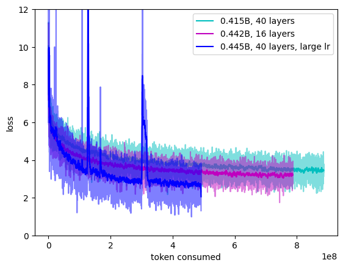

# 习作小模型

我想，没手搓过小模型并从原始数据进行过预训练就不能算是入门了这一代生成式AI吧。同样，要做一些实验，总还是需要一个试验田。

目前只做了预训练，后续也许会做一些强化学习、低bit训练之类的我感兴趣的东西进来。

## 授权

由于本项目使用了Meta Llama和huggingface/transformers的代码，所以需服从它们的授权协议。

## 架构

* 模型结构：Llama
  * Llama的结构非常基础，没有太多科技狠活，适宜学习。
  * 代码中很大一部分是从huggingface/transformers库里面直接抄的。
* 数据类型：
  * 主干： bfloat16
    * bfloat16精度很糟糕，在一些较宽的配置上不收敛或者收敛情况很糟糕，遇到坏的数据集很容易被训练坏
    * 需要配合梯度裁剪使用
  * softmax: float32
    * 由于softmax的性质必须用高精度，记得在transformers还是llama的github上看到过一个issue，因为开源出来的时候疏忽而实用了半精度，导致微调炸裂，生成的质量也相当糟糕
* Tokenizer：偷的ChatGLM3的tokenizer，词表大小为64K，我主要做中文，所以这个应该够用。
  * 偷这些大厂的词表的问题在于他们往往没有把0号位空出来用于padding，代码编写上非常不便，所以往往需要自己offset一下。

参数上分别考量了深和浅两种，效果比较微妙。看样子40层网络继续训练下去也许能超过16层网络？但我不打算投入更多机时了。

Loss随投入token的进展如图，训练到图上的程度大概需要七八个小时，那个large lr的由于序列长度更大，所以吃token的速度更慢：



（large lr指学习率为2e-3）

* MobileLLM[1]论文鼓励了较深的层数，也许能有效？
  * 这个文章给了非常大的学习率，实际效果一路火花带闪电（可能我batch size太小），最终效果似乎还行。
* 也训练了一个28层的，loss在两者之间，图都画出来比较乱就不放了。

参数对比：

```python
# 40层, hidden_size=512
# * Embedding与LM分类头各占参数量的7.9%
# * Decoder层占参数量的84%
self.config = custom_model.CustomModelConfig(
    vocab_size=self.tokenizer.vocab_size(),
    padding_token_id=self.tokenizer.token_pad_id,
    max_position_embeddings=4096,
    hidden_size=512,
    num_heads=16,
    MLP_intermediate=5000,
    num_layers=40,
    attention_dropout=0.1,
    dtype=torch.bfloat16,
    training=True,
    linear_imp = torch.nn.Linear
)
```

```python
# 16层, hidden_size=1024
# * Embedding与LM分类头各占参数量的14.8%
# * Decoder层占参数量的70%
self.config = custom_model.CustomModelConfig(
    vocab_size=self.tokenizer.vocab_size(),
    padding_token_id=self.tokenizer.token_pad_id,
    max_position_embeddings=4096,
    hidden_size=1024,
    num_heads=16,
    MLP_intermediate=5000,
    num_layers=16,
    attention_dropout=0.1,
    dtype=torch.bfloat16,
    training=True,
    linear_imp = torch.nn.Linear
)
```

## 训练配置

* 数据集：THUCNNEWS，清华大学出的一个早年的新浪网新闻的数据集，从种类上不是很平衡，但贵在语料质量高，不容易训崩。
  * 一开始也实验了悟道[2]和万卷[3]数据集，其中包含的垃圾信息特别多，很难清洗出来，容易训炸，对于我这样token consumption不容易做大的项目来说不太友好
  * 当然没有附上数据集，若是想要运行，需要你自己去下载打乱并且pickle。参考`thucnnews_dataset.py`
* 优化器：bitsandbytes.optim.AdamW8bit
  * 感觉bitsandbytes这个AdamW里面加了一些魔法，更稳定的同时效果还更好
  * betas：(0.9, 0.95)
    * 也是来自于MobileLLM[1]论文
    * 考虑到默认值是(0.9, 0.999)，这算是相当激进的配置了。
  * 一开始没有上梯度裁剪的时候发现这个AdamW8bit比起pytorch默认的AdamW更不容易崩溃，而且收敛效果也比较好，看文档说是里面加入了相当多的科技狠活
* 学习率：1e-4
  * 试过1e-5，bf16基本训不动
  * 也试过更大的1e-3，和1e-4一样，很容易训炸。
  * MobileLLM提到了更大的学习率（2e-3）。
    * 最后实验了一下，同时放宽了梯度裁剪限制，并增加了序列长度，效果相当刺激，但确实收敛了，token consumption更少，loss还更低，生成的文本似乎比较之前短seq length低学习率更好，但也训练得更慢
* 梯度裁剪的max norm设置为1.0
* batch size:
  * batch size = 16
  * 训练序列长度为192
  * gradient accumulation steps为20
  * 这样一次优化可以吃进61k tokens
  
## 效果

看起来能生成一点车轱辘话，还挺有意思的：

```txt
test input: 中兴手机
test out: ['中兴手机：3G手机将成3G手机\n\u3000\u3000新浪科技讯 10月11日消息，中兴通讯董事长兼CEO王晓初表示，中兴通讯将推出基于Android平台的3G手机，并计划在未来3年内推出3G手机。\n\u3000\u3000王晓初表示，中兴通讯将推出基于Android平台的3G手机，并计划在未来3年内推出3G手机。\n\u3000\u3000王晓初表示，中兴通讯将推出基于Android平台的3G手机，并']
test input: 外交部网站22日发布
test out: ['外交部网站22日发布新闻通稿\n\u3000\u3000新华网北京1月10日电 外交部发言人马朝旭10日在北京举行例行记者会，就“中国外交”等国际问题回答记者提问。\n\u3000\u3000马朝旭说，中国是亚太地区的最大贸易伙伴国，中方高度重视亚太地区的国际和地区事务，愿同亚太地区的国际组织和组织加强合作，共同维护亚太地区的和平与稳定。\n\u3000\u3000马朝旭说，中方高度重视亚太地区的国际和地区问题']
test input: 基因组信息在生命科学研究中具有重要价值
test out: ['基因组信息在生命科学研究中具有重要价值\n\u3000\u3000新浪科技讯 北京时间10月16日消息，据国外媒体报道，美国科学家发现，在生命科学领域，人类在生命科学领域所具有的基因特征和特征是生命科学领域所具有的。\n\u3000\u3000在人类历史上，人类在生命科学领域所具有的基因特征和特征是生命科学领域所具有的。在人类历史上，人类在生命科学领域所具有的基因特征是生命科学领域所具有的基因特征。\n']
```

## 解码

解码就是一个贪心解码，参看`pretrain.py`里面的`_run_test()`方法。

## CMMLU测试

得分很糟糕，基本就是乱猜，毕竟训练数据有限，而且也没有经过任何SFT，但是整合的过程还算有趣。CMMLU的代码比较糟糕，没什么文档，要接入自己的模型还得去debug看他们到底给模型输入了什么，需要输出什么。

如果要玩的话，参考`CMMLU.ipynb`和`CMMLU/README.md`。

## 引用

1. MobileLLM: Optimizing Sub-billion Parameter Language Models for On-Device Use Cases https://arxiv.org/abs/2402.14905
2. WuDaoCorpora Text文本预训练数据集 https://data.baai.ac.cn/details/WuDaoCorporaText
3. 书生·万卷多模态语料库 https://opendatalab.com/OpenDataLab/WanJuan1_dot_0